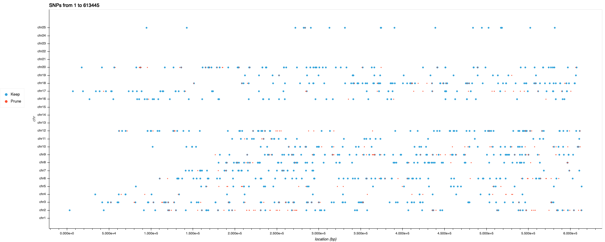
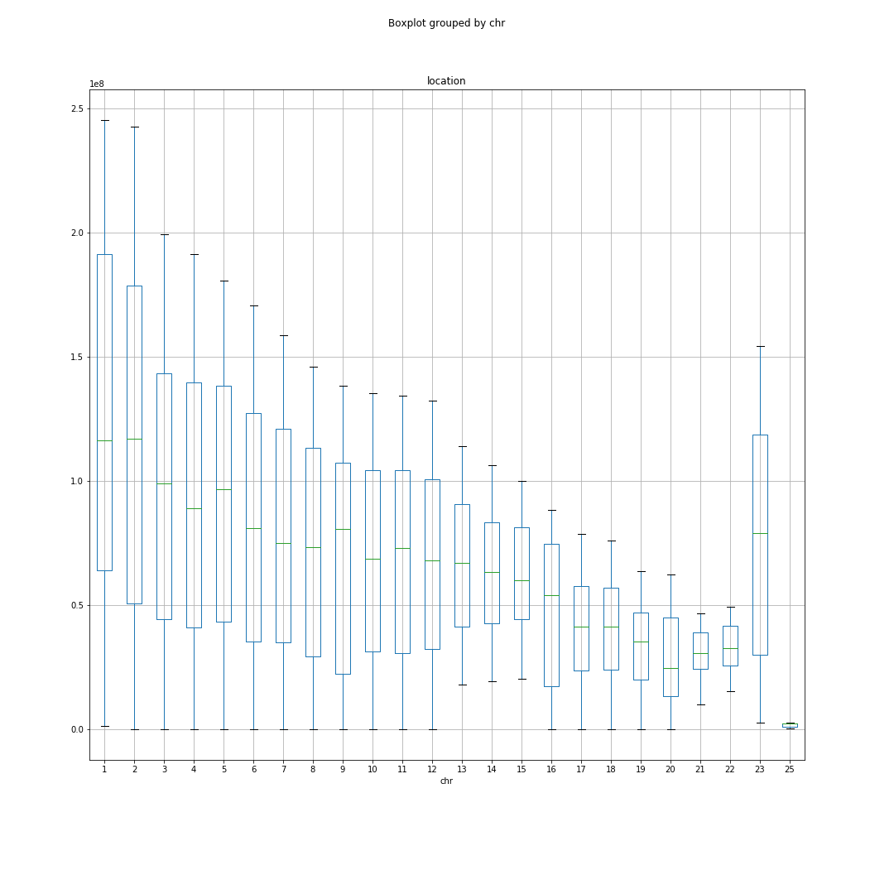

# Visualize Linkage Disequilibrium Data
Functions to visualise linkage disequilibrium analysis with scatter plots 

# Purpose

Creates a scatter plot of results from linkage disequilibrium analysis. Specifically, these functions use results from plink analysis using version 1.07 and the command line argument:

```

$ ./plink --indep <window size>['kb'] <step size (variant ct)> <VIF threshold>
  
```
which outputs these files:

```
filename.prune.in
filename.prune.out

```
## Input Files

All are plink files. 

```
filename.prune.in
filename.prune.out
filename.map

```
I used a dataset for alzheimers disease (adgwas), the plink files for which can be found [here](https://drive.google.com/drive/folders/1ud5F9WN9Xx3oXIkb5xIg1b_zz1nzp3IR)

## Downloads you will need:

```
import pandas as pd
import numpy as np
import matplotlib.pyplot as plt
import holoviews as hv
from holoviews import opts
hv.extension('bokeh')

``` 

## Output

Generates x # of png images using the [holoviews](http://holoviews.org/reference/index.html) library with the 'bokeh' backend to generate scatter plots and used 'matplotlib' without holoviews to generate boxplots.

# Instructions

### Step 1: Create dataframes from plink files with proper column headings to be used downstream

Use filename prefix only in file paths. Plink automatically includes .prune.in, .prune.out, and .map extensions
``` 
ldPath = '~/path/to/ldfiles/filePrefixOnly'
mapPath = '~/path/to/.mapfile/filePrefixOnly'

df_snps_in, df_snps_out = create_df_from_plink_ld(ldPath,mapPath)


``` 
### Scatterplots

The division argument will create the number of base pairs each image will cover. The adgwas data covers a lot of the genome so the default is set 400. Meaning 400  images will be generated with totalSNPs//400 bases pairs along the x axis in each image.

Use output from previous function for next step:

``` 
imagesPath = '~/path/to/images/folder'

create_scatter_plot_for_plink_ld(df_snps_in,df_snps_out,imagesPath)

``` 


## Boxplots

Visualize the two distribution of distances for SNP's that will be kept and pruned

Input: dataframes from step 1 

``` 
imagesPath = '~/path/to/images/folder'

create_scatter_plot_for_plink_ld(df_snps_in,df_snps_out,imagesPath)

``` 

